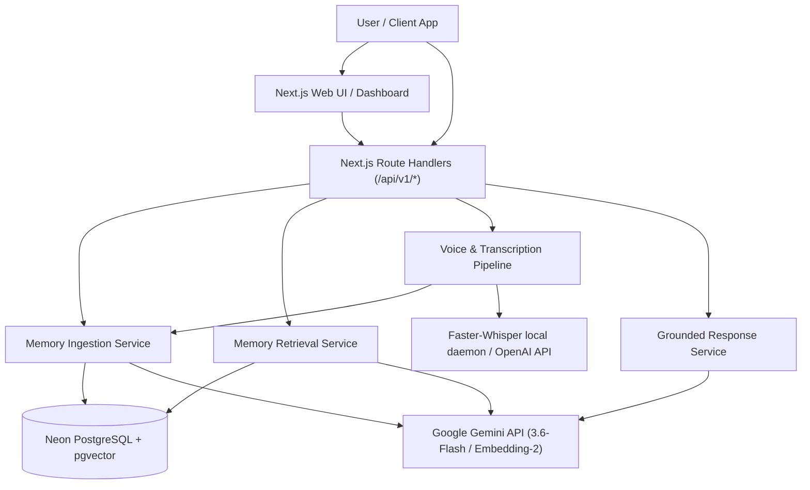
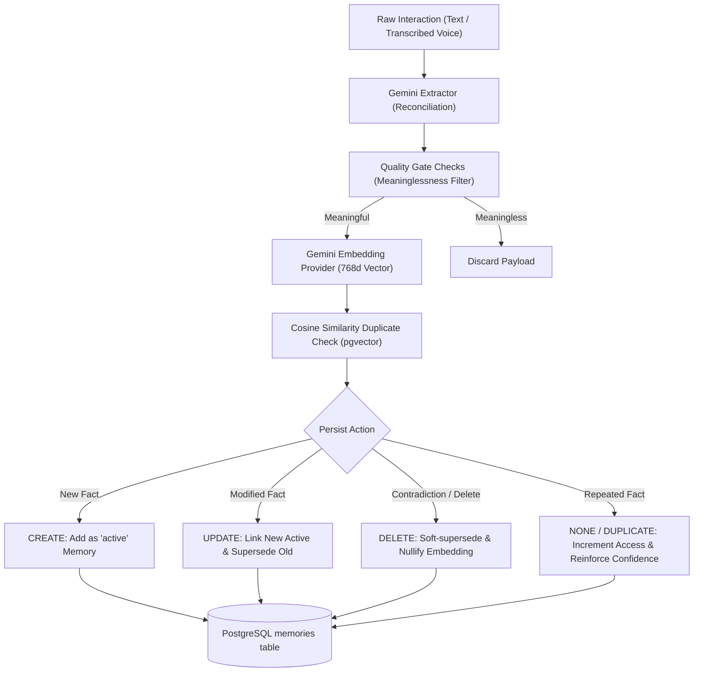
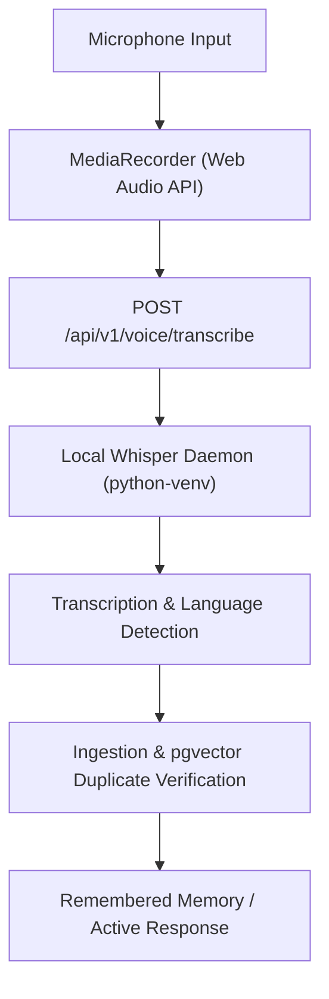
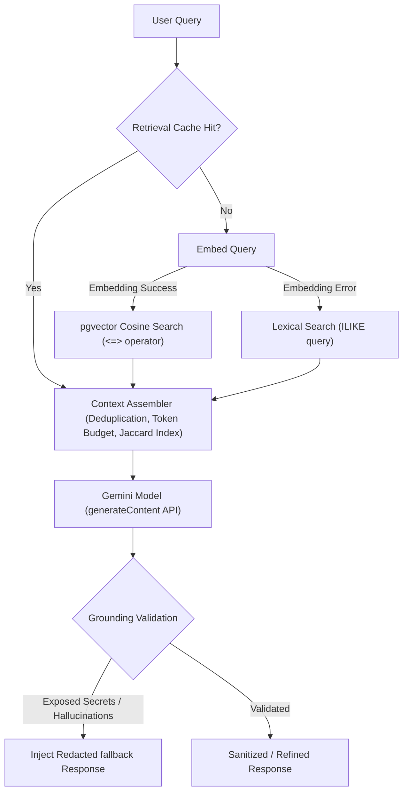
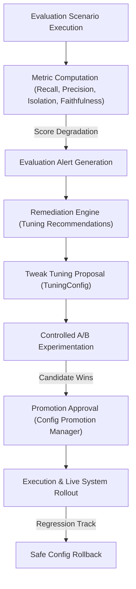

# Mnemos

[](https://www.typescriptlang.org/)
[](https://nextjs.org/)
[](https://neon.tech/)
[](https://vitest.dev/)
[](LICENSE)

Mnemos is a persistent AI memory and context engine designed for long-term, grounded, context-aware personal AI. It enables autonomous agents and applications to persist, recall, reconcile, and continuously update user-specific contexts across session boundaries.

---

## Overview

Traditional LLM interactions are state-locked. Standard RAG (Retrieval-Augmented Generation) lacks human factors (e.g., changes in user preferences or long-term goals), while simple chat history dumps quickly bloat the context window. 

Mnemos operates as a specialized cognitive layer that:
1. **Extracts and Reconciles**: Analyzes conversation transcripts to extract structured facts and reconcile new data with existing memories.
2. **Excludes and Restricts**: Automatically handles contradicted or superseded statements (e.g., updating a user preference from "dark coffee" to "light tea").
3. **Retrieves and Grounds**: Employs hybrid `pgvector` semantic lookup and Jaccard-based lexical search to build compact, highly-relevant context blocks, enforcing strict response grounding and preventing hallucinations.
4. **Verifies and Tunes**: Runs closed-loop evaluation datasets to score precision, recall, and faithfulness, dynamically adjusting retrieval weights to optimize context relevance.

---

## System Architecture

The following diagram illustrates the interaction flow across the client layer, Next.js API handlers, database persistence, and external model/transcription services:



---

## Memory Lifecycle

Mnemos models memories using structured domains (`FACT`, `PREFERENCE`, `GOAL`, `DECISION`, `EVENT`, `RELATIONSHIP`). Ingested information transitions through a stateful pipeline to determine if it should be created, reinforced, updated, or soft-deleted:



### Lifecycle Functions
* **Supersession & Temporal Linking**: When a memory is updated, a new active memory is created pointing to the old one (`supersedes` field) and the old one is marked as `'superseded'` (`validUntil` and `supersededBy` fields) to prevent stale facts from entering the retrieval pool.
* **Reinforcement**: Repeated interactions of the same fact (crossing a similarity threshold of `0.88`) trigger a confidence boost (incrementing confidence score up to a maximum of `1.0` in steps of `0.05`) and increment access metrics.
* **Decay & State Derivation**: Active memories decay dynamically based on usage frequency:
  $$\text{decayFactor} = \frac{1}{1 + \frac{\text{elapsedDays}}{90}}$$
  Memories are categorized into:
  * `core`: High importance ($\ge 8$), confidence ($\ge 0.8$), and decay factor ($\ge 0.5$).
  * `stable`: Medium confidence ($\ge 0.5$) or highly accessed ($\ge 5$), decay factor ($\ge 0.5$).
  * `fading`: Low confidence, importance, or aged access.
  * `historical`: Formally superseded or deleted records.

---

## Voice Interaction Pipeline

Mnemos includes a built-in voice processing pipeline supporting browser recording, local audio transcribing, and direct-to-memory ingestion.



* **Local Whisper Server**: A multi-threaded python server utilizing `faster-whisper` handles audio payloads locally. It implements an automatic GPU-to-CPU fallback, loading models in `int8` on CPU or `float16` on CUDA (GPU) dynamically.
* **Whisper Quality Gate**: Filters out meaningless transcription noise, short clips, and standard filler phrases (`uh`, `um`, `testing`, `hello`) prior to running costly LLM extraction steps.
* **Multilingual Auto-detection**: Whisper automatically detects languages (fully optimized for Hindi and English voice statements), passing raw text for multilingual processing.

---

## Retrieval & Grounding

The Context Assembly engine ensures the LLM receives only clean, relevant, and authorized context under the token budget:



* ** pgvector Semantic Query**: Generates a 768-dimension embedding via `gemini-embedding-2` and queries database candidates with Cosine Distance: `(1 - (embedding <=> $1::vector))`.
* **Lexical Fallback**: If the embedding provider fails, the system automatically falls back to an `ILIKE` keyword match to ensure system availability.
* **Jaccard Similarity Filtering**: Excludes overlapping memories and duplicate historical contexts to optimize token usage.
* **Grounded Guardrail**: Sanitizes output responses by checking for leaked secrets/diagnostics and confirming semantic alignment between the LLM's claims and the retrieved context.

---

## Evaluation & Auto-Remediation

Mnemos features a closed-loop evaluation system that continuously audits memory reliability, performance, and accuracy:



* **Computed Metrics**:
  * *Retrieval Recall*: Ratio of expected memories returned in semantic database lookup.
  * *Context Precision*: Accuracy of assembler ranking.
  * *User Isolation*: Validates that queries never retrieve cross-user data (enforced at both database and service levels).
  * *Faithfulness*: Verifies grounded responses match original memories without hallucination.
  * *Citation Correctness*: Assures cited memories are active, correctly referenced, and were present in the prompt context.
* **Auto-Tuning**: Compares control vs. candidate configurations (`semanticWeight`, `lexicalWeight`, `minSimilarity`, `diversityThreshold`) to optimize context relevance dynamically.
* **Remediation & Rollbacks**: Automatically flags regressions and allows immediate config rollbacks if an adjustment degrades system accuracy.

---

## Tech Stack

* **Frontend/Backend**: Next.js 16.3.1 (App Router), React 19.2.8
* **Language**: TypeScript 5.x
* **Database**: PostgreSQL (Neon Serverless) with `pgvector` extension
* **Styling**: Pure CSS (custom warm-minimal design system variables)
* **Local Voice Server**: Python 3, FastAPI / Threading HTTP, `faster-whisper`
* **Test Suite**: Vitest 4.1.10

---

## Project Structure

```text
src/
├── app/                  # Next.js App Router (UI & Route Handlers)
│   ├── api/              # API Route Handlers (v1 Developer & UI backend)
│   ├── globals.css       # Central design system CSS variables and styling classes
│   ├── layout.tsx        # Dashboard layout wrapping UI font stack
│   └── page.tsx          # Mnemos developer & diagnostic dashboard
├── core/                 # Core domain models, interfaces, and configs
│   ├── config.ts         # Constants & defaults
│   ├── logger.ts         # Diagnostic logging utilities
│   └── types.ts          # Contracts (Memory, MemoryType, User, etc.)
├── db/                   # Database client, health tests, and migrations
│   ├── migrate.ts        # Database migration execution script
│   └── schema.sql        # Reference SQL schema definition
├── memory/               # Persistent memory storage logic
│   ├── repository.ts     # Database PostgreSQL CRUD operations
│   ├── retriever.ts      # Semantic pgvector and lexical retrieval
│   └── ingestionService.ts# Pipeline (quality check, extraction, supersession)
├── context/              # Context building & prompt assembly
│   └── assembler.ts      # Context ranking, Jaccard sorting, token budget enforcement
├── voice/                # Local/cloud voice transcription
│   ├── localWhisperTranscription.ts # Local server lifecycle manager
│   ├── transcription_server.py # Multi-threaded python Whisper daemon
│   └── whisperTranscription.ts # OpenAI Cloud Whisper fallback
├── response/             # Response generation & grounding validations
│   ├── geminiGenerator.ts# Google Gemini API connector
│   ├── service.ts        # Orchestrates retrieval and response generation
│   └── resilience.ts     # Retry logic, timeout aborts, backoffs
└── evaluation/           # Simulation dataset, quality gates, remediation tuning
```

---

## Getting Started

### Setup Configuration
Clone the repository, install Node.js dependencies, and duplicate `.env.example`:
```bash
git clone https://github.com/Nataraj-EL/mnemos.git
cd mnemos
npm install
cp .env.example .env
```

### Database Initialization
Apply SQL migrations to your Neon database using the automated migrations script:
```bash
npm run migrate
```

### Running local Whisper Daemon
To use local offline voice transcription, set up the Python environment:
```bash
# Initialize venv
python3 -m venv venv
source venv/bin/activate

# Install dependencies (faster-whisper, numpy)
pip install -r requirements.txt
```
*Note: Next.js automatically spawns and manages the lifecycle of the python transcription server background process when voice APIs are triggered, as long as `WHISPER_PROVIDER=local` is set.*

### Launching Developer Server
Run the Next.js local development server:
```bash
npm run dev
```
Open [http://127.0.0.1:3000](http://127.0.0.1:3000) to access the dashboard.

---

## Environment Configuration

| Variable | Purpose | Required | Default |
| -------- | ------- | -------- | ------- |
| `DATABASE_URL` | Neon PostgreSQL database connection string | Yes | - |
| `GEMINI_API_KEY` | Google AI Studio developer API key | Yes | - |
| `EXTRACTION_MODEL` | Gemini LLM name used for context extraction & reconciliation | No | `gemini-3.6-flash` |
| `GENERATION_MODEL` | Gemini LLM name used for response generation | No | `gemini-3.6-flash` |
| `EMBEDDING_MODEL` | Gemini model name used for query vectorization | No | `gemini-embedding-2` |
| `EMBEDDING_DIMENSION` | Dimensions of the vector index | No | `768` |
| `WHISPER_PROVIDER` | Execution endpoint selection (`local` or `cloud`) | No | `local` |
| `LOCAL_WHISPER_PORT` | Local port for Whisper daemon subprocess | No | `50051` |
| `LOCAL_WHISPER_MODEL` | Local model file download target (`tiny`, `base`, `small`) | No | `tiny` |
| `WHISPER_DEVICE` | Hardware accelerator selector (`cpu`, `cuda`, `auto`) | No | `auto` |
| `MNEMOS_AUTH_ENABLED` | Toggle developer route authorization checking | No | `false` |
| `MNEMOS_API_KEY` | Developer authorization header key verification token | No | - |
| `RATE_LIMIT_MAX_REQUESTS` | Limit of queries permitted per window | No | `100` |
| `RATE_LIMIT_WINDOW_SECONDS`| Time frame size in seconds | No | `60` |

---

## Developer API Overview

All routes follow the JSend JSON format and include a unique `requestId` for tracing.

### Ingest Memory
* **Method**: `POST`
* **Path**: `/api/v1/memory/ingest`
* **Request**:
  ```json
  {
    "userId": "user-123",
    "content": "I prefer using dark mode in VS Code."
  }
  ```
* **Response**:
  ```json
  {
    "status": "success",
    "data": {
      "memories": [
        {
          "id": "c1f75d31-41db-49aa-84d4-53907c1ba21a",
          "userId": "user-123",
          "type": "PREFERENCE",
          "content": "I prefer using dark mode in VS Code.",
          "metadata": { "status": "active", "confidence": 0.9 }
        }
      ]
    },
    "requestId": "req-1724683012903"
  }
  ```

### Search memories
* **Method**: `POST`
* **Path**: `/api/v1/memory/search`
* **Request**:
  ```json
  {
    "userId": "user-123",
    "query": "coding theme preference",
    "limit": 3
  }
  ```

### Voice Transcribe and Ingest
* **Method**: `POST`
* **Path**: `/api/v1/voice/transcribe`
* **Headers**: `Content-Type: multipart/form-data`
* **Form Data**:
  * `file`: (Binary Audio Blob)
  * `userId`: `user-123`
* **Response**:
  ```json
  {
    "status": "success",
    "data": {
      "text": "I prefer using dark mode.",
      "outcome": "created",
      "saved": true,
      "memories": [...]
    }
  }
  ```

---

## Verification & Tests

Mnemos includes a comprehensive local test suite containing 70 files and 590 unit tests. All tests run deterministically using mocked database and API boundaries.

### Run Tests
```bash
npm run test
```

### Run Linter
```bash
npm run lint
```

### Run Production Build
```bash
npm run build
```

---

## Security & Privacy Considerations

* **User Isolation Safeguard**: Cross-user boundary checking is enforced during semantic queries and ancestor updates. Database queries explicitly bind filters using parameters (`WHERE user_id = $2`) to prevent data leaking.
* **Response Grounding Redaction**: Sanitizes output strings. If the LLM generates a response referencing database UUIDs or internal prompts, the output is intercepted and replaced with a sanitized fallback response.
* **Local-First Transcription**: Transcribing local audio buffers on CPU/GPU avoids leaking voice data to third-party endpoints.

---

## License

This project is licensed under the [MIT License](LICENSE). Copyright (c) 2026 Nataraj EL.
